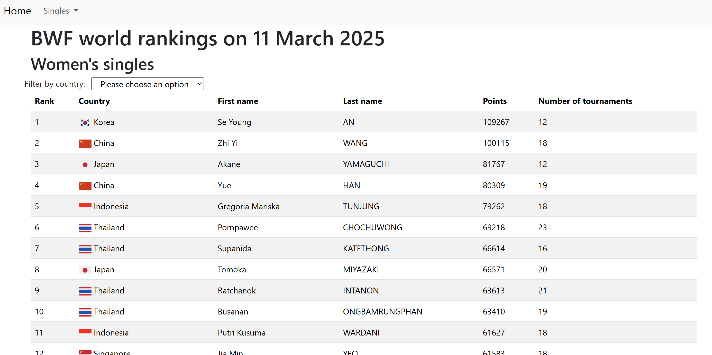
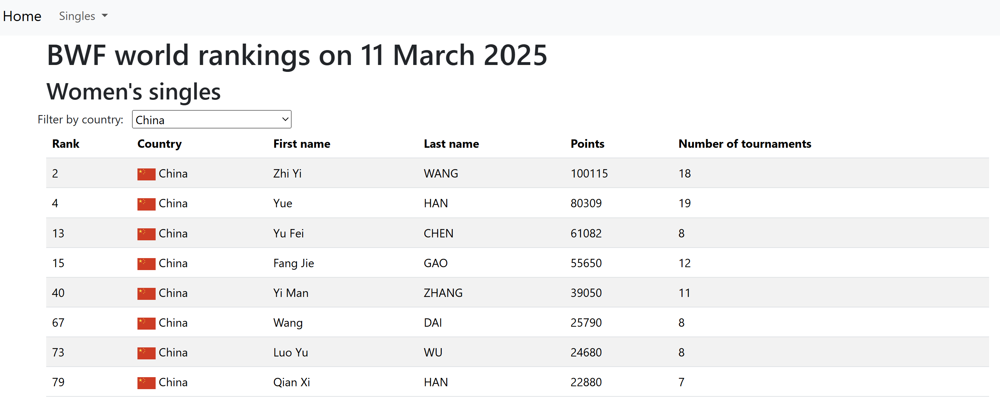

# BWF singles world rankings

An application that both displays the most recent top 100 men's and women's singles badminton players and serves as an API to retrieve these two lists.

The website is available at this address:

https://bwf-singles-world-rankings.onrender.com/.

Please wait one minute while the instance restarts.

## Description of the website

1. The most recent top 100 women's and men's singles players are displayed in a table.

2. This table can be filtered by country.

3. Pie charts show the number of players per country in each top 100.

## Description of the API

The API is accessible at this address:

https://bwf-singles-world-rankings.onrender.com/bwfapi/.

1. To retrieve the list of the top 100 women's singles players, use the endpoint: womens_singles/.

Similarly, the list of the top 100 men's singles players has the endpoint mens_singles/.

2. To get the player at rank i, add i to the former endpoint.

## Database

The database simply contains 2 tables : FemaleSinglePlayer and MaleSinglePlayer. They both have the same fields: rank, first_name, last_name, date (of the displayed rankings), country, country_image, nb_tournaments and points.

## Technologies used

- Django and Django REST framework
- JavaScript (to filter the players by country)
- Bootstrap
- Selenium (to scrape tournamentsoftware)